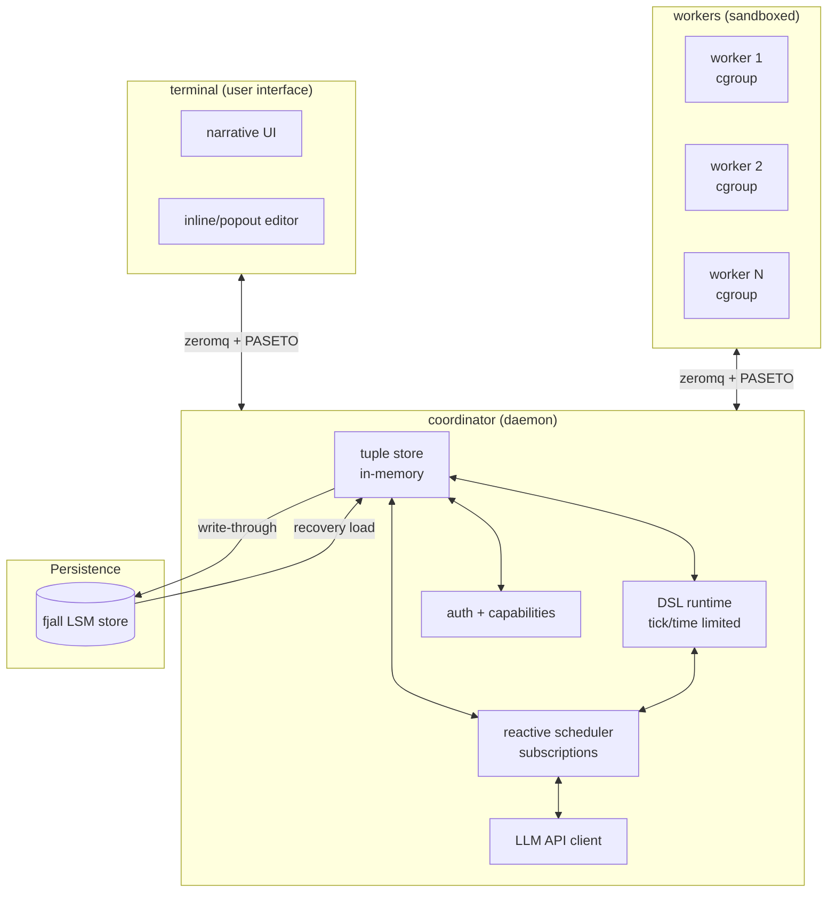

# FMPL vs. Collaborative Agentic System: Comparison (CORRECTED)

> **Date**: 2026-01-20 (Updated)
> **Key Corrections**:
> - FMPL **does have tuple space plans** (see `research/2025-12-27-tuplespace-vat-actor-conversion.md`)
> - FMPL **facets ARE capabilities** (object-bound capability system, not "access control")

---

## Executive Summary

| Aspect | FMPL | Collaborative Agentic |
|--------|------|---------------------|
| **Architecture** | Single-process VM with async ops | Multi-process coordinator + workers |
| **Coordination Model** | Grammars over streams + **planned tuple space** | Tuple space with reactive subscriptions |
| **Multi-user** | Not designed (shared VM) | First-class (users as entities, PASETO) |
| **Execution Model** | Stack-based VM with async streams | Reactive task scheduling |
| **Persistence** | Fjall (object graph, streaming) | Fjall (tuple store, write-through) |
| **Security** | **Facets (object-bound capabilities)** | Capabilities (hierarchical, revocable, token-based) |
| **LLM Integration** | Streaming grammars over async streams | Centralized API client with caching |
| **Sandboxing** | None | cgroups, seccomp, per-task limits |

**Key Insight**: **Both systems converge on tuple space coordination and capability-based security**. FMPL approaches agents as **grammars over streams** (push model, pattern-based) with **planned tuple space integration**, while collaborative system uses **tuple spaces with reactive subscriptions** (pull/push hybrid, state-based). Both are capability-based: FMPL uses **object-bound facets**, agentic uses **token-based hierarchical capabilities**.

---

## Correction 1: FMPL Has Tuple Space Plans

### FMPL's Tuple Space Design (from `research/2025-12-27-tuplespace-vat-actor-conversion.md`)

FMPL has researched and designed Linda-style tuple space integration:

**Proposed API:**
```fmpl
-- Basic tuple operations
tuplespace.out(tuple)
tuplespace.in(pattern)    -- blocking, destructive
tuplespace.rd(pattern)   -- blocking, non-destructive
tuplespace.inp(pattern)   -- non-blocking, destructive
tuplespace.rdp(pattern)   -- non-blocking, non-destructive

-- Stream integration
stream { tuplespace.match(pattern) }
tuplespace.stream(pattern)
```

**Integration with Streams:**
```fmpl
-- Tuple space as stream root
stream { tuplespace }

-- Filter tuples via pattern
tuplespace.stream("(task ?id status: ?s)")
  |> filter(|t| t.status == "pending")
  |> dispatch_task
```

**Storylet Actions as Tuples:**
```fmpl
-- Current continuations store action history as JSON
-- Planned: rewrite as tuple stream
%{type: :choice, choice: :listen, timestamp: 1700000000, player: @id}
```

**Security Model for Tuple Space:**
```fmpl
-- Put tuplespace behind a capability (facet) with per-player namespaces
let (tuplespace = object TupleSpace {
  namespaces: [:system, :player_123, :player_456],
  facets: [
    facet(:system) { members: ["out", "in", "rd"], terminal: true },
    facet(:player) { members: ["rd"], terminal: true }
  ]
}) in

-- Players can read but not write
tuplespace.as(:player).rd("(task ?id status: ?s)")
```

**Status**: ⏳ Designed but not implemented (see `research/2025-12-27-tuplespace-vat-actor-conversion.md`)

---

### Comparison: Tuple Space Approaches

| Aspect | FMPL (Designed) | Collaborative Agentic |
|--------|-----------------|---------------------|
| **Model** | Linda-style with stream integration | Linda-style with reactive subscriptions |
| **API** | `out`/`in`/`rd` + `stream()` | `out`/`in`/`rd` + `on(pattern)` |
| **Integration** | Tuples as stream sources | Tuples trigger subscriptions |
| **Security** | Behind facets (per-player namespaces) | Behind capabilities (namespace-based) |
| **Persistence** | In-memory + Fjall (planned) | In-memory + Fjall (write-through) |
| **Status** | Designed, not implemented | Designed, not implemented |

**Convergence**: Both systems use Linda-style tuple spaces! FMPL integrates tuples **as streams**, agentic uses tuples **for reactive scheduling**.

---

## Correction 2: Facets ARE Capabilities

### FMPL Facets (from `fmpl-core/src/object.rs`)

**Facet Definition:**
```rust
pub struct Facet {
    /// Which properties/methods are accessible through this facet
    pub members: Vec<SmolStr>,
    /// End of delegation chain (cannot re-facet)
    pub terminal: bool,
}

/// Object has multiple facets
pub struct Object {
    pub id: ObjectId,
    pub facets: HashMap<SmolStr, Facet>,
    // ... other fields
}
```

**Usage in FMPL:**
```fmpl
-- Define object with facets
let (doc = object Document {
  content: "secret data",
  facets: [
    facet(:public) { members: ["read"], terminal: false },
    facet(:editor) { members: ["read", "write"], terminal: false },
    facet(:admin) { members: ["read", "write", "delete"], terminal: true }
  ]
}) in

-- Access via facet (capability request)
doc.as(:public).read()   -- OK
doc.as(:public).write()  -- ERROR (not in :public members)
doc.as(:editor).write()   -- OK
doc.as(:admin).delete()   -- OK
```

**Key Properties:**
1. **Capability**: A facet IS a capability - it grants specific rights (members)
2. **Object-bound**: Facets are defined on objects, not separate tokens
3. **Static**: Facets are defined at object creation, not dynamically attenuated
4. **Terminal**: `terminal: bool` prevents re-faceting (capability attenuation)
5. **Inheritance**: Facets follow prototype chain (`get_facet()` looks up parent)

**Status**: ✅ Fully implemented in `fmpl-core/src/object.rs`

---

### Agentic Capabilities (from agentic system design)

**PASETO Token Structure:**
```
Token = PASETO(signing_key, {
  worker: 7,
  caps: [
    "fs:read:/src/project/**",
    "fs:write:/src/project/src/**",
    "shell:cargo"
  ],
  exp: timestamp
})
```

**Hierarchical Attenuation:**
```
User caps: fs:**, shell:*, net:*
  ↓ grants subset
Worker caps: fs:read:/src/project/**, fs:write:/src/project/src/**, shell:cargo
  ↓ LLM attenuates based on task needs
Task caps: fs:read,write:src/foo.rs, shell:cargo test
  ↓ further attenuates
Subtask caps: fs:read:src/foo.rs, shell:cargo test --no-run
```

**Revocation:**
```rust
// Revoke all worker capabilities instantly
key_store.delete(signing_key_for_worker_7);
```

**Key Properties:**
1. **Capability**: Token IS the capability - encoded as PASETO
2. **Token-based**: Separate from data, can be transmitted over network
3. **Dynamic**: Attenuated at runtime by user or LLM
4. **Hierarchical**: Multi-level (User → Worker → Task → Subtask)
5. **Revocable**: Delete signing key = instant invalidation

**Status**: ⏳ Designed but not implemented

---

### Comparison: Facets vs. PASETO Capabilities

| Aspect | FMPL Facets | Agentic PASETO |
|--------|------------|------------------|
| **Capability type** | Object-bound facets | Token-based (PASETO) |
| **Binding** | Facets attached to objects | Tokens transmitted over network |
| **Attenuation** | Static (defined at creation) | Dynamic (runtime hierarchy) |
| **Hierarchy** | Single level (facet lists) | Multi-level (User→Worker→Task→Subtask) |
| **Revocation** | None (facets are static) | Instant (delete signing key) |
| **Verification** | `facet_allows(id, facet, member)` | `PASETO.verify(token, signing_key)` |
| **Scoping** | Per-object | Namespace-based (`/project/foo/...`) |
| **Delegation** | `obj.as(:facet)` (explicit) | Token grants (implicit via attenuation) |
| **Terminal** | `terminal: bool` prevents re-facet | No delegation beyond task level |

**Both ARE capabilities** - just different implementation choices:
- **Facets**: Object-bound, static, good for local access control
- **PASETO**: Token-based, dynamic, good for multi-user distributed systems

---

## Architecture Comparison (CORRECTED)

### FMPL Architecture

```mermaid
graph TB
    subgraph FMPL["fmpl-web (single process)"]
        Server[Axum HTTP Server]
        VM[Shared Arc<Mutex<Vm>>]
        Runtime[Tokio Runtime]
    end

    subgraph Grammar["Streaming Grammars"]
        Grammar[Grammar Definition]
        Parser[PEG Parser]
        Stream[Async Stream]
    end

    subgraph Persistence["Fjall Persistence"]
        Store[(LSM Store)]
        Image[(Live Image)]
    end

    subgraph TupleSpace["Tuple Space (Planned)"]
        TS[Linda-style Tuples]
        Subs[Stream Integration]
    end

    subgraph External["External Tools"]
        LLM[LLM API]
        HTTP[HTTP/WS]
    end

    Server --> Runtime
    Runtime --> VM
    VM --> Grammar
    Grammar --> Parser
    Parser --> Stream
    Stream --> LLM
    Stream --> HTTP
    VM --> Store
    Store --> Image
    VM -.planned.-> TS
    TS -.planned.-> Subs
    Subs --> Stream
```

**Current FMPL Components:**
- ✅ **Streaming grammars**: Incremental PEG parsing with backtracking
- ✅ **Async operations**: `<-` operator returns streams, tokio runtime handle
- ✅ **Fjall persistence**: Live image serialization, streaming position overflow
- ✅ **Grammar application**: `@` operator for pushing values through grammars
- ✅ **Exception handling**: Cross-frame exception unwinding with try/catch
- ✅ **Stream pipelines**: Lazy stream operations (map, filter, parse, async-parse)
- ✅ **Facets (capabilities)**: Object-bound capability system fully implemented
- ⏳ **Tuple space**: Linda-style `out`/`in`/`rd` designed but not implemented
- ⏳ **LLM integration**: Streaming grammars designed for LLM output, but no client
- ⏳ **Task model**: No task abstraction, suspend/resume not full
- ⏳ **Multi-user**: Single `Arc<Mutex<Vm>>` — no isolation

---

### Collaborative Agentic System Architecture



**Agentic System Components (designed):**
- **Tuple store**: In-memory persistent datalog with logical queries
- **Reactive scheduler**: Subscription-based dispatch on tuple changes
- **DSL runtime**: Tick-limited, time-limited execution
- **LLM client**: Centralized API access with caching
- **Auth + capabilities**: PASETO tokens, hierarchical attenuation
- **Persistence**: Write-through to Fjall, instant recovery

---

## Where FMPL and Agentic Converge

### 1. Tuple Space Coordination

**Both systems use Linda-style tuple spaces:**

| Feature | FMPL (Planned) | Agentic (Designed) |
|---------|----------------|------------------|
| **Basic ops** | `out`/`in`/`rd` | `out`/`in`/`rd` |
| **Non-blocking** | `inp`/`rdp` | `inp`/`rdp` |
| **Pattern matching** | Map/list patterns | Map/list patterns |
| **Persistence** | Fjall (in-memory + spill) | Fjall (write-through) |
| **Security** | Behind facets (namespaces) | Behind capabilities (namespaces) |

**Key difference**: Integration model
- **FMPL**: Tuples **as stream sources** (`stream { tuplespace }`)
- **Agentic**: Tuples **trigger subscriptions** (`on (pattern) { handler }`)

**Convergence**: FMPL could add subscriptions, agentic could expose tuples as streams.

---

### 2. Capability-Based Security

**Both systems are capability-based:**

| Aspect | FMPL Facets | Agentic PASETO |
|--------|------------|------------------|
| **Philosophy** | Object-bound capabilities | Token-based capabilities |
| **Capability** = | Facet on object | PASETO token |
| **Verification** | `facet_allows()` runtime check | `PASETO.verify()` crypto check |
| **Scope** | Per-object (properties/methods) | Namespace-based (`/project/foo/...`) |
| **Attenuation** | Static (facet definition) | Dynamic (hierarchical) |
| **Revocation** | None | Instant (delete key) |
| **Delegation** | Explicit (`obj.as(:facet)`) | Implicit (token grant) |

**Both follow capability security principles:**
- ✅ Principle of least privilege (grant minimum needed)
- ✅ No ambient authority (must present capability)
- ✅ Fine-grained access control (per-member or per-namespace)

**Key difference**: Deployment model
- **Facets**: Local, single-user, good for REPL/storylets
- **PASETO**: Distributed, multi-user, good for agentic workflows

**Convergence**: FMPL could add PASETO for multi-user, agentic could use facets for local object security.

---

## Where FMPL and Agentic Diverge

### 1. Agent Model

| Aspect | FMPL | Agentic |
|--------|------|----------|
| **Agent definition** | Grammar over streams (declarative) | DSL script (imperative) |
| **Control flow** | Pattern matching + semantic predicates | Imperative control flow |
| **State** | Pure (no mutable state in grammar) | Stateful (task holds bindings) |
| **Composition** | Grammar inheritance (`grammar Foo <: Bar`) | Task hierarchy (spawn/fork) |

**FMPL approach**: Agent = grammar that pattern-matches on message stream
```fmpl
grammar TaskAgent <: Agent {
  turn =
    | message:m &{ needs_approval(m) } => <- human.ask(m) @ approval_handler
    | message:m => process(m) @ result_handler
}
```

**Agentic approach**: Agent = task with lifecycle
```
spawn {
  let (result = rd((task ?id result:?r)))
  on (task ?id status:"completed") { resume_with(result) }
}
```

**Tradeoff**: Expressiveness vs. control
- **FMPL**: More declarative, composable, but less explicit state
- **Agentic**: More explicit state and control, but imperave

---

### 2. Execution Model

| Aspect | FMPL | Agentic |
|--------|------|----------|
| **Execution** | Stack-based VM (single thread) | Reactive scheduling (N workers) |
| **Concurrency** | Async tasks (tokio) | Multi-process (coordinator + workers) |
| **Isolation** | Shared `Arc<Mutex<Vm>>` | Per-worker VM + cgroups |
| **Backpressure** | Stream channels (blocking) | Tuple space (blocking in/rd) |
| **Recovery** | Reload live image from Fjall | Replay tuples, re-subscribe |

**Tradeoff**: Simplicity vs. scalability
- **FMPL**: Simple (single process), but no horizontal scaling
- **Agentic**: Complex (multi-process), but scalable and isolated

---

### 3. Multi-User Architecture

| Aspect | FMPL | Agentic |
|--------|------|----------|
| **Users** | Not a concept | First-class entities with PASETO tokens |
| **Isolation** | None (shared VM) | Per-worker VM + capabilities |
| **Namespaces** | Not designed | `/user/`, `/project/`, `/system/` |
| **Auth** | None | OAuth2/password + PASETO |
| **Coordination** | Stream pipelines | Tuple space subscriptions |

**Tradeoff**: REPL vs. production
- **FMPL**: Great for single-user REPL, storylet games
- **Agentic**: Required for multi-user agentic workflows

---

## Strategic Recommendation

### Option 1: FMPL as-is (Single-User REPL)

**Best for:**
- Storylet games and interactive fiction
- Single-user REPL and exploration
- Research into streaming grammars
- Local capability-based object security

**Not suitable for:**
- Multi-user agentic workflows
- Distributed agent coordination
- Production multi-user systems

**Effort**: Minimal (continue current direction)

---

### Option 2: Separate Agentic System

**Best for:**
- Multi-user AI-assisted development
- Distributed agent coordination
- Production multi-user systems

**Not suitable for:**
- Single-user REPL (overkill)
- Local experiments (too complex)

**Effort**: 6-12 months (coordinator, tuple store, scheduler, workers)

---

### Option 3: Hybrid (RECOMMENDED)

**Architecture:**
```
Coordinator + Tuple Store + PASETO (from agentic)
  └── Workers (sandboxed processes)
      └── Each runs FMPL VM
          ├── Streaming grammars (from FMPL)
          ├── Facets (from FMPL)
          └── Tuple space integration (from FMPL plans)
```

**Best of both:**
- ✅ Declarative agents: FMPL grammars express agent behavior
- ✅ Tuple coordination: Linda-style shared coordination
- ✅ Capability security: Facets (local) + PASETO (multi-user)
- ✅ Isolation: Per-worker VM with cgroups
- ✅ Scalability: Coordinator dispatches, workers execute
- ✅ Leverages FMPL investment: 6,500 lines of streaming grammar work

**Integration path:**
1. Build coordinator with tuple store and scheduler (agentic)
2. Build worker runtime that spawns FMPL VMs
3. Implement tuple space operations in FMPL (`out`/`in`/`rd`)
4. Add PASETO token support to coordinator + workers
5. Wire FMPL grammars to tuple space (read/write tuples)

**Estimated effort**: 4-8 months

---

## Implementation Priority (for Hybrid)

### Phase 1: Complete FMPL Tuple Space (in progress)
- [ ] Implement `out`/`in`/`rd`/`inp`/`rdp` operations
- [ ] Add stream integration (`stream { tuplespace }`)
- [ ] Add namespace support behind facets
- [ ] Add Fjall persistence for tuples
- [ ] Add tests for Linda-style coordination

### Phase 2: Worker Runtime
- [ ] Build worker process that spawns FMPL VM instances
- [ ] Add cgroup/seccomp sandboxing
- [ ] Add ZeroMQ + PASETO client
- [ ] Add heartbeat and liveness monitoring

### Phase 3: Coordinator
- [ ] Build coordinator daemon with tuple store
- [ ] Implement reactive scheduler with subscriptions
- [ ] Add PASETO token signing/verification
- [ ] Add OpenAI API client with caching

### Phase 4: Integration
- [ ] Wire workers to coordinator via ZeroMQ
- [ ] Implement task dispatch and recovery
- [ ] Add namespace-based capability enforcement
- [ ] Build terminal UI

---

## References

### FMPL Design Docs
- [FMPL Revival Design](../plans/2025-12-19-fmpl-revival-design.md) - Overall language vision
- [Unified Grammars and Agents](../plans/2026-01-19-unified-grammars-and-agents-design.md) - Agent as Grammar pattern
- [Streaming Grammar Push Model](../plans/2026-01-20-streaming-grammar-push-model-implementation-plan.md) - Incremental parsing
- **[Tuple Space VAT Actor Conversion](../research/2025-12-27-tuplespace-vat-actor-conversion.md)** - FMPL's tuple space plans

### FMPL Implementation
- `fmpl-core/src/object.rs` - Facet capability system
- `fmpl-core/src/grammar/` - OMeta-style PEG grammars
- `fmpl-core/src/grammar/incremental.rs` - ParseState/ParseNext
- `fmpl-core/src/grammar/driver.rs` - ParseDriver for async pipelines

### Agentic System Design
- [Original System Spec](system-spec.md) - Multi-user, multi-agent system
- [LindaSpaces Book](../research/lindaspaces-book/) - Tuple space coordination patterns

### Related Work
- [OMeta](https://tinlizzie.org/ometa/) - OMeta PEG parsing
- [Spritely Goblins](https://spritely.institute/goblins/) - Async object capability patterns
- [mooR](https://timbran.org/book/html/introduction.html) - MOO-style object database
- [RLM (Recursive Language Models)](https://alexzhang13.github.io/blog/2025/rlm/) - Agent coordination

---

**Status**: FMPL has implemented streaming grammars and async infrastructure, with facet-based capabilities and **planned tuple space integration**. The agentic system design adds multi-user, multi-agent coordination with reactive tuple scheduling and PASETO capabilities. **Both systems converge on tuple spaces and capabilities**. The hybrid approach (Option 3) is recommended to leverage FMPL's grammars and facets while adding coordinator-level coordination and multi-user capabilities of the agentic system.
