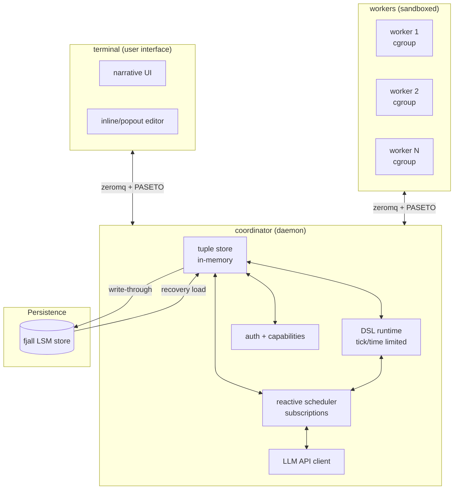

# FMPL vs. Collaborative Agentic System: Comparison (FINAL)

> **Date**: 2026-01-20 (Final Update)
> **Key Corrections**:
> - FMPL **is Goblins-inspired** with VAT model (event loop/tick-based)
> - FMPL **has tuple space plans** (research on VAT→tuple space conversion)
> - FMPL **facets ARE capabilities** (Goblins-style object-bound capabilities)

---

## Executive Summary

| Aspect | FMPL | Collaborative Agentic |
|--------|------|---------------------|
| **Architecture** | **Single-vat VM** (event loop, tick-based) | Multi-process coordinator + workers |
| **Coordination Model** | Grammars over streams + **planned tuple space** | Tuple space with reactive subscriptions |
| **Object Model** | **Goblins-inspired** (spawn/bcom, `$`/`<-`) | No defined object model |
| **Multi-user** | Not designed (shared VM) | First-class (users as entities, PASETO) |
| **Execution Model** | **VAT event loop** (single-threaded, async) | Reactive task scheduling (multi-process) |
| **Persistence** | Fjall (live image, streaming) | Fjall (tuple store, write-through) |
| **Security** | **Facets (Goblins-style capabilities)** | Capabilities (PASETO, hierarchical) |
| **Transactions** | **Automatic** (errors roll back state) | Manual (tuple space transactions) |
| **LLM Integration** | Streaming grammars over async streams | Centralized API client with caching |
| **Sandboxing** | None | cgroups, seccomp, per-task limits |

**Key Insight**: FMPL is a **Goblins-inspired, single-vat system** with streaming grammars, facet-based capabilities, and **planned tuple space integration**. The agentic system is a **multi-process, tuple-space-based** system with reactive scheduling and PASETO capabilities. **Both converge on tuple spaces and capabilities**, but differ in:
- **Execution**: VAT event loop (FMPL) vs. reactive scheduler (agentic)
- **Object model**: Goblins spawn/bcom (FMPL) vs. not defined (agentic)
- **Multi-user**: Single-vat (FMPL) vs. multi-process (agentic)

---

## FMPL's Goblins-Inspired VAT Model

### What is a VAT?

From **Spritely Goblins**:
- A VAT is a **single-threaded event loop** hosting multiple actors/objects
- No shared mutable state across VATs (isolation guaranteed)
- Actors communicate via messages (asynchronous)
- Each turn processes messages until no more pending

FMPL's approach (from `plans/2025-12-19-fmpl-revival-design.md`):
```fmpl
-- The initial spike is single-vat: each HTTP request is a tick,
-- and stream evaluation is synchronous within that tick.
```

### Goblins Patterns in FMPL

**1. spawn and bcom**

```fmpl
-- spawn creates object instances
let (obj = spawn ^constructor args)

-- bcom enables functional state updates
object ^cell (bcom, val) {
  get(): val
  set(new_val): bcom(^cell(bcom, new_val))
}
```

**2. Sync vs Async**

```fmpl
$ obj.method()    -- synchronous (same vat)
<- obj.method()   -- asynchronous (returns promise/stream)
```

**3. Automatic Transactions**

Errors roll back all state changes in current turn:

```fmpl
$ cell.set(42)    -- state change
error("Oops!")    -- cell.get() still returns old value
```

**4. Promise Pipelining**

```fmpl
<- (<- bank.get_account("alice")).get_balance()
-- Single network round trip, not two
```

**Status**: ⏳ Goblins-inspired patterns designed, but not fully implemented
- ✅ `spawn` and `<-` async operator implemented
- ⏳ `bcom` not implemented
- ⏳ Automatic transactions not implemented
- ⏳ Promise pipelining not implemented

---

### Comparison: VAT vs. Coordinator

| Aspect | FMPL VAT | Agentic Coordinator |
|--------|----------|-------------------|
| **Execution model** | Single-threaded event loop | Multi-threaded scheduler |
| **Concurrency** | Async tasks within VAT | Workers (separate processes) |
| **Isolation** | No shared state across VATs | Per-worker VM + cgroups |
| **Message passing** | Direct object references | Tuple space (shared memory) |
| **Scheduling** | Turn-based (process all messages) | Reactive (subscriptions fire on changes) |
| **Transactions** | Automatic (error = rollback) | Manual (tuple transactions) |
| **Scaling** | Single VAT (no horizontal scaling) | Multiple workers (horizontal scaling) |

**Tradeoff**: Simplicity vs. scalability
- **VAT**: Simple (single thread, no locks), but can't scale horizontally
- **Coordinator**: Complex (multi-process, tuple space), but scales horizontally

---

## Correction 1: FMPL Has Tuple Space Plans

### FMPL's Tuple Space Design (from `research/2025-12-27-tuplespace-vat-actor-conversion.md`)

Research on converting FMPL's **VAT/actor model** to **Linda-style tuple space**:

**Proposed API:**
```fmpl
-- Basic tuple operations
tuplespace.out(tuple)
tuplespace.in(pattern)    -- blocking, destructive
tuplespace.rd(pattern)   -- blocking, non-destructive
tuplespace.inp(pattern)   -- non-blocking, destructive
tuplespace.rdp(pattern)   -- non-blocking, non-destructive

-- Stream integration
stream { tuplespace.match(pattern) }
tuplespace.stream(pattern)
```

**Integration with Streams:**
```fmpl
-- Tuple space as stream root
stream { tuplespace }

-- Filter tuples via pattern
tuplespace.stream("(task ?id status: ?s)")
  |> filter(|t| t.status == "pending")
  |> dispatch_task
```

**Storylet Actions as Tuples:**
```fmpl
-- Current continuations store action history as JSON
-- Planned: rewrite as tuple stream
%{type: :choice, choice: :listen, timestamp: 1700000000, player: @id}
```

**Security Model for Tuple Space:**
```fmpl
-- Put tuple space behind a capability (facet) with per-player namespaces
let (tuplespace = object TupleSpace {
  namespaces: [:system, :player_123, :player_456],
  facets: [
    facet(:system) { members: ["out", "in", "rd"], terminal: true },
    facet(:player) { members: ["rd"], terminal: true }
  ]
}) in

-- Players can read but not write
tuplespace.as(:player).rd("(task ?id status: ?s)")
```

**Key Research Questions:**
- Addressing vs. Matching: Actors use explicit addresses, tuple space uses pattern matching
- Ordering: Tuple space is nondeterministic (use sequence numbers/timestamps)
- Blocking: `in`/`rd` are blocking in Linda → maps to stream suspension
- Isolation: VATs guarantee local isolation, tuple space is shared → namespace by VAT/capability

**Status**: ⏳ Designed but not implemented (see `research/2025-12-27-tuplespace-vat-actor-conversion.md`)

---

### Comparison: VAT Actor Model vs. Tuple Space

| Aspect | VAT Actor Model (FMPL) | Tuple Space (Agentic) |
|--------|---------------------|-------------------|
| **Communication** | Direct sends to object ID | Pattern matching on tuples |
| **Addressing** | Explicit (object IDs) | Implicit (patterns) |
| **Ordering** | Per-sender guaranteed | Nondeterministic (multiple matches) |
| **Blocking** | Async sends, non-blocking | `in`/`rd` are blocking |
| **State** | Encapsulated in actors | Shared in tuple space |
| **Time/space decoupling** | No (sender must exist) | Yes (producers/consumers don't need to know each other) |

**Conversion implications** (from research):
- Tuple space can provide **time/space decoupling** for multi-VAT coordination
- FMPL could use tuple space as **coordination layer between VATs**
- Namespacing by VAT/capability can provide **isolation** in shared tuple space

---

### Comparison: Tuple Space Approaches

| Aspect | FMPL (Designed) | Collaborative Agentic |
|--------|-----------------|---------------------|
| **Model** | Linda-style with stream integration | Linda-style with reactive subscriptions |
| **API** | `out`/`in`/`rd` + `stream()` | `out`/`in`/`rd` + `on(pattern)` |
| **Integration** | Tuples as stream sources | Tuples trigger subscriptions |
| **Security** | Behind facets (per-player namespaces) | Behind capabilities (namespace-based) |
| **Persistence** | In-memory + Fjall (planned) | In-memory + Fjall (write-through) |
| **Status** | Designed, not implemented | Designed, not implemented |

**Convergence**: Both systems use Linda-style tuple spaces! FMPL integrates tuples **as streams**, agentic uses tuples **for reactive scheduling**.

---

## Correction 2: Facets ARE Capabilities

### FMPL Facets (Goblins-Style, from `fmpl-core/src/object.rs`)

**Facet Definition:**
```rust
pub struct Facet {
    /// Which properties/methods are accessible through this facet
    pub members: Vec<SmolStr>,
    /// End of delegation chain (cannot re-facet)
    pub terminal: bool,
}

/// Object has multiple facets
pub struct Object {
    pub id: ObjectId,
    pub facets: HashMap<SmolStr, Facet>,
    // ... other fields
}
```

**Usage in FMPL (from `plans/2025-12-19-fmpl-revival-design.md`):**
```fmpl
-- Define object with facets
object treasury {
  .#private
  balance: 10000

  .#public
  view_balance(): self.balance
  withdraw(amt): { ... }

  .#facets
  auditor: [view_balance]
  treasurer: [view_balance, withdraw]
}

-- Get restricted view
treasury.as(:auditor).view_balance()   -- works
treasury.as(:auditor).withdraw(100)    -- error: not on facet
treasury.as(:treasurer).withdraw(100)   -- works
```

**Terminal Facets:**
```fmpl
-- Non-delegatable views use `!` suffix
.#facets
  customer!: [greet, buy]  -- cannot be passed to others
```

**Key Properties (Goblins-inspired):**
1. **Capability**: A facet IS a capability - it grants specific rights (members)
2. **Object-bound**: Facets are defined on objects, not separate tokens
3. **Static**: Facets are defined at object creation, not dynamically attenuated
4. **Terminal**: `terminal: bool` prevents re-faceting (capability attenuation)
5. **Goblins security**: Follows Spritely's object-capability model

**Status**: ✅ Fully implemented in `fmpl-core/src/object.rs`

---

### Agentic Capabilities (from agentic system design)

**PASETO Token Structure:**
```
Token = PASETO(signing_key, {
  worker: 7,
  caps: [
    "fs:read:/src/project/**",
    "fs:write:/src/project/src/**",
    "shell:cargo"
  ],
  exp: timestamp
})
```

**Hierarchical Attenuation:**
```
User caps: fs:**, shell:*, net:*
  ↓ grants subset
Worker caps: fs:read:/src/project/**, fs:write:/src/project/src/**, shell:cargo
  ↓ LLM attenuates based on task needs
Task caps: fs:read,write:src/foo.rs, shell:cargo test
  ↓ further attenuates
Subtask caps: fs:read:src/foo.rs, shell:cargo test --no-run
```

**Revocation:**
```rust
// Revoke all worker capabilities instantly
key_store.delete(signing_key_for_worker_7);
```

**Key Properties:**
1. **Capability**: Token IS a capability - encoded as PASETO
2. **Token-based**: Separate from data, can be transmitted over network
3. **Dynamic**: Attenuated at runtime by user or LLM
4. **Hierarchical**: Multi-level (User → Worker → Task → Subtask)
5. **Revocable**: Delete signing key = instant invalidation

**Status**: ⏳ Designed but not implemented

---

### Comparison: Facets vs. PASETO Capabilities

| Aspect | FMPL Facets (Goblins) | Agentic PASETO |
|--------|---------------------|------------------|
| **Capability type** | Object-bound facets | Token-based (PASETO) |
| **Binding** | Facets attached to objects | Tokens transmitted over network |
| **Attenuation** | Static (defined at creation) | Dynamic (runtime hierarchy) |
| **Hierarchy** | Single level (facet lists) | Multi-level (User→Worker→Task→Subtask) |
| **Revocation** | None (facets are static) | Instant (delete signing key) |
| **Verification** | `facet_allows(id, facet, member)` | `PASETO.verify(token, signing_key)` |
| **Scoping** | Per-object | Namespace-based (`/project/foo/...`) |
| **Delegation** | `obj.as(:facet)` (explicit) | Token grants (implicit via attenuation) |
| **Terminal** | `terminal: bool` prevents re-facet | No delegation beyond task level |
| **Philosophy** | **Goblins object-capability** | Capability security (general) |

**Both ARE capabilities** - just different implementation choices:
- **Facets**: Object-bound, static, Goblins-style, good for local access control
- **PASETO**: Token-based, dynamic, good for multi-user distributed systems

---

## Architecture Comparison (FINAL)

### FMPL Architecture (Goblins-Inspired, Single-VAT)

```mermaid
graph TB
    subgraph FMPL["fmpl-web (single VAT)"]
        Server[Axum HTTP Server]
        VM[Single-Threaded<br/>Event Loop VAT]
        Runtime[Tokio Runtime]
    end

    subgraph ObjectModel["Goblins Object Model"]
        Spawn[spawn/^constructor]
        Bcom[bcom state updates]
        Sync[$ obj.method()]
        Async[<- obj.method()]
    end

    subgraph Grammar["Streaming Grammars"]
        Grammar[Grammar Definition]
        Parser[PEG Parser]
        Stream[Async Stream]
    end

    subgraph Security["Goblins Security"]
        Facets[Faceted Views]
        Terminal[Terminal Facets!]
    end

    subgraph Persistence["Fjall Persistence"]
        Store[(LSM Store)]
        Image[(Live Image)]
    end

    subgraph TupleSpace["Tuple Space (Planned)"]
        TS[Linda-style Tuples]
        Subs[Stream Integration]
        VATns[VAT Namespacing]
    end

    subgraph External["External Tools"]
        LLM[LLM API]
        HTTP[HTTP/WS]
    end

    Server --> Runtime
    Runtime --> VM
    VM --> ObjectModel
    VM --> Grammar
    Grammar --> Parser
    Parser --> Stream
    Stream --> LLM
    Stream --> HTTP
    VM --> Store
    Store --> Image
    VM --> Security
    VM -.planned.-> TS
    TS -.planned.-> Subs
    TS -.planned.-> VATns
    Subs --> Stream
```

**Current FMPL Components:**
- ✅ **Single-VAT event loop**: Tick-based execution, each HTTP request is a tick
- ✅ **Streaming grammars**: Incremental PEG parsing with backtracking
- ✅ **Async operations**: `<-` operator returns streams, tokio runtime handle
- ✅ **Fjall persistence**: Live image serialization, streaming position overflow
- ✅ **Grammar application**: `@` operator for pushing values through grammars
- ✅ **Exception handling**: Cross-frame exception unwinding with try/catch
- ✅ **Stream pipelines**: Lazy stream operations (map, filter, parse, async-parse)
- ✅ **Facets (capabilities)**: Goblins-style object-bound capability system
- ✅ **spawn operator**: Goblins-inspired object creation
- ⏳ **bcom**: Functional state updates (planned, not implemented)
- ⏳ **Automatic transactions**: Error rollbacks (planned, not implemented)
- ⏳ **Promise pipelining**: Nested async optimization (planned, not implemented)
- ⏳ **Tuple space**: Linda-style `out`/`in`/`rd` designed but not implemented
- ⏳ **LLM integration**: Streaming grammars designed for LLM output, but no client
- ⏳ **Task model**: No task abstraction, suspend/resume not full
- ⏳ **Multi-user**: Single `Arc<Mutex<Vm>>` — no isolation

---

### Collaborative Agentic System Architecture



**Agentic System Components (designed):**
- **Tuple store**: In-memory persistent datalog with logical queries
- **Reactive scheduler**: Subscription-based dispatch on tuple changes
- **DSL runtime**: Tick-limited, time-limited execution
- **LLM client**: Centralized API access with caching
- **Auth + capabilities**: PASETO tokens, hierarchical attenuation
- **Persistence**: Write-through to Fjall, instant recovery

---

## Where FMPL and Agentic Converge

### 1. Tuple Space Coordination

**Both systems use Linda-style tuple spaces:**

| Feature | FMPL (Planned) | Agentic (Designed) |
|---------|-----------------|------------------|
| **Basic ops** | `out`/`in`/`rd` | `out`/`in`/`rd` |
| **Non-blocking** | `inp`/`rdp` | `inp`/`rdp` |
| **Pattern matching** | Map/list patterns | Map/list patterns |
| **Persistence** | Fjall (in-memory + spill) | Fjall (write-through) |
| **Security** | Behind facets (namespaces) | Behind capabilities (namespaces) |
| **VAT integration** | Namespacing by VAT (planned) | Not applicable |

**Key difference**: Integration model
- **FMPL**: Tuples **as stream sources** in VAT event loop (`stream { tuplespace }`)
- **Agentic**: Tuples **trigger subscriptions** in reactive scheduler (`on (pattern) { handler }`)

**Convergence**: FMPL could add subscriptions, agentic could expose tuples as streams.

---

### 2. Capability-Based Security

**Both systems are capability-based:**

| Aspect | FMPL Facets (Goblins) | Agentic PASETO |
|--------|---------------------|------------------|
| **Philosophy** | Object-bound capabilities | Token-based capabilities |
| **Capability** = | Facet on object | PASETO token |
| **Verification** | `facet_allows()` runtime check | `PASETO.verify()` crypto check |
| **Scope** | Per-object (properties/methods) | Namespace-based (`/project/foo/...`) |
| **Attenuation** | Static (facet definition) | Dynamic (hierarchical) |
| **Revocation** | None | Instant (delete key) |
| **Delegation** | Explicit (`obj.as(:facet)`) | Implicit (token grant) |
| **Terminal** | `terminal: bool` prevents re-facet | No delegation beyond task level |

**Both follow capability security principles:**
- ✅ Principle of least privilege (grant minimum needed)
- ✅ No ambient authority (must present capability)
- ✅ Fine-grained access control (per-member or per-namespace)

**Key difference**: Deployment model
- **Facets**: Local, single-VAT, good for REPL/storylets
- **PASETO**: Distributed, multi-user, good for agentic workflows

**Convergence**: FMPL could add PASETO for multi-user, agentic could use facets for local object security.

---

### 3. Async Programming Model

| Aspect | FMPL (Goblins) | Agentic |
|--------|---------------|----------|
| **Same-VAT sync** | `$ obj.method()` | Not applicable (multi-process) |
| **Cross-VAT async** | `<- obj.method()` (returns stream) | Tuple space (blocking) |
| **Pipelining** | Planned (nested async in one round-trip) | Not applicable |
| **Transactions** | Automatic (error = rollback) | Manual (tuple transactions) |
| **Backpressure** | Stream channels (blocking) | Tuple space (blocking in/rd) |

**Key difference**: Execution model
- **FMPL**: Goblins-style `$` (sync) vs `<-` (async) in VAT
- **Agentic**: Tuple space blocking via `in`/`rd`

---

## Where FMPL and Agentic Diverge

### 1. Agent Model

| Aspect | FMPL | Agentic |
|--------|------|----------|
| **Agent definition** | Grammar over streams (declarative) | DSL script (imperative) |
| **Object model** | Goblins spawn/bcom | Not defined |
| **Control flow** | Pattern matching + semantic predicates | Imperative control flow |
| **State** | Pure (no mutable state in grammar) | Stateful (task holds bindings) |
| **Composition** | Grammar inheritance (`grammar Foo <: Bar`) | Task hierarchy (spawn/fork) |
| **Transactions** | Automatic (Goblins) | Manual (tuple space) |

**FMPL approach**: Agent = grammar that pattern-matches on message stream
```fmpl
grammar TaskAgent <: Agent {
  turn =
    | message:m &{ needs_approval(m) } => <- human.ask(m) @ approval_handler
    | message:m => process(m) @ result_handler
}
```

**Agentic approach**: Agent = task with lifecycle
```
spawn {
  let (result = rd((task ?id result:?r)))
  on (task ?id status:"completed") { resume_with(result) }
}
```

**Tradeoff**: Expressiveness vs. control
- **FMPL**: More declarative, composable, but less explicit state
- **Agentic**: More explicit state and control, but imperative

---

### 2. Execution Model

| Aspect | FMPL VAT | Agentic Coordinator |
|--------|----------|-------------------|
| **Execution** | Single-threaded event loop (VAT) | Reactive scheduler (multi-process) |
| **Concurrency** | Async tasks (tokio) within VAT | Workers (separate processes) |
| **Isolation** | No shared state across VATs (only one VAT) | Per-worker VM + cgroups |
| **Message passing** | Direct object references (`$`/`<-`) | Tuple space (shared memory) |
| **Scheduling** | Turn-based (process all messages in tick) | Reactive (subscriptions fire on changes) |
| **Transactions** | Automatic (error = rollback) | Manual (tuple transactions) |
| **Scaling** | Single VAT (no horizontal scaling) | Multiple workers (horizontal scaling) |
| **Complexity** | Simple (no locks, single thread) | Complex (tuple space, scheduler, workers) |

**Tradeoff**: Simplicity vs. scalability
- **FMPL VAT**: Simple (single thread, no locks), but can't scale horizontally
- **Agentic**: Complex (multi-process, tuple space), but scales horizontally

---

### 3. Multi-User Architecture

| Aspect | FMPL | Agentic |
|--------|------|----------|
| **VAT model** | Single VAT (all users share) | Not applicable (multi-process) |
| **Users** | Not a concept | First-class entities with PASETO tokens |
| **Isolation** | None (shared VM within VAT) | Per-worker VM + capabilities |
| **Namespaces** | Not designed | `/user/`, `/project/`, `/system/` |
| **Auth** | None | OAuth2/password + PASETO |
| **Coordination** | Stream pipelines | Tuple space subscriptions |
| **VAT-to-VAT** | Not designed (single VAT) | Coordinator mediates between workers |

**Tradeoff**: REPL vs. production
- **FMPL**: Great for single-user REPL, storylet games
- **Agentic**: Required for multi-user agentic workflows

---

## Strategic Recommendation

### Option 1: FMPL as-is (Single-VAT REPL)

**Best for:**
- Storylet games and interactive fiction
- Single-user REPL and exploration
- Research into Goblins patterns
- Research into streaming grammars
- Local capability-based object security (facets)

**Not suitable for:**
- Multi-user agentic workflows
- Distributed agent coordination
- Production multi-user systems
- Horizontal scaling

**Effort**: Minimal (continue current direction)

---

### Option 2: Separate Agentic System

**Best for:**
- Multi-user AI-assisted development
- Distributed agent coordination
- Production multi-user systems
- Horizontal scaling

**Not suitable for:**
- Single-user REPL (overkill)
- Local experiments (too complex)
- Goblins-style object capability patterns (not used)

**Effort**: 6-12 months (coordinator, tuple store, scheduler, workers)

---

### Option 3: Hybrid - Multi-VAT with Coordinator (RECOMMENDED)

**Architecture:**
```
Coordinator + Tuple Store + PASETO (from agentic)
  └── N Workers (separate processes)
      └── Each runs FMPL VAT (single-threaded event loop)
          ├── Goblins object model (spawn/bcom)
          ├── Facets (capabilities)
          ├── Streaming grammars
          └── Tuple space integration
```

**Why Hybrid:**
1. **Multi-VAT scaling**: Each worker is a separate VAT → horizontal scaling
2. **Goblins patterns**: Preserve spawn/bcom, automatic transactions
3. **Tuple coordination**: Use tuple space for VAT-to-VAT coordination
4. **Facet security**: Local object security within each VAT
5. **PASETO security**: Cross-VAT security (user → worker → task)
6. **Leverages FMPL investment**: 6,500 lines of streaming grammar work

**Integration path:**
1. Build coordinator with tuple store and scheduler
2. Build worker processes that each run FMPL VAT
3. Implement tuple space operations in FMPL (`out`/`in`/`rd`)
4. Add PASETO token support to coordinator + workers
5. Wire FMPL grammars to tuple space (read/write tuples)
6. Implement multi-VAT message passing via tuple space

**Estimated effort**: 4-8 months

---

## Implementation Priority (for Hybrid)

### Phase 1: Complete FMPL Core (in progress)
- [ ] Complete streaming grammar Tasks 6-9
- [ ] Implement `bcom` (functional state updates)
- [ ] Implement automatic transactions (error rollbacks)
- [ ] Implement promise pipelining
- [ ] Add tuple space operations (`out`/`in`/`rd`)
- [ ] Add namespace support behind facets
- [ ] Add Fjall persistence for tuples

### Phase 2: Multi-VAT Worker Runtime
- [ ] Build worker process that runs FMPL VAT
- [ ] Add cgroup/seccomp sandboxing per worker
- [ ] Add ZeroMQ + PASETO client
- [ ] Add heartbeat and liveness monitoring
- [ ] Add VAT-to-VAT communication via tuple space

### Phase 3: Coordinator
- [ ] Build coordinator daemon with tuple store
- [ ] Implement reactive scheduler with subscriptions
- [ ] Add PASETO token signing/verification
- [ ] Add OpenAI API client with caching
- [ ] Add worker lifecycle management

### Phase 4: Integration
- [ ] Wire workers to coordinator via ZeroMQ
- [ ] Implement task dispatch and recovery
- [ ] Add namespace-based capability enforcement
- [ ] Build terminal UI
- [ ] Add VAT namespace partitioning in tuple space

---

## References

### FMPL Design Docs
- [FMPL Revival Design](../plans/2025-12-19-fmpl-revival-design.md) - Goblins-inspired patterns, VAT model
- [Unified Grammars and Agents](../plans/2026-01-19-unified-grammars-and-agents-design.md) - Agent as Grammar pattern
- [Streaming Grammar Push Model](../plans/2026-01-20-streaming-grammar-push-model-implementation-plan.md) - Incremental parsing
- [Tuple Space VAT Actor Conversion](../research/2025-12-27-tuplespace-vat-actor-conversion.md) - VAT to tuple space research

### FMPL Implementation
- `fmpl-core/src/object.rs` - Facet capability system (Goblins-style)
- `fmpl-core/src/grammar/` - OMeta-style PEG grammars
- `fmpl-core/src/grammar/incremental.rs` - ParseState/ParseNext
- `fmpl-core/src/grammar/driver.rs` - ParseDriver for async pipelines

### Spritely Goblins
- [Goblins Homepage](https://spritely.institute/goblins/) - Distributed, transactional programming
- [Goblins Whitepaper](https://files.spritely.institute/papers/spritely-core.html) - Object capability patterns, VAT model

### Agentic System Design
- [Original System Spec](system-spec.md) - Multi-user, multi-agent system
- [LindaSpaces Book](../research/lindaspaces-book/) - Tuple space coordination patterns

### Related Work
- [OMeta](https://tinlizzie.org/ometa/) - OMeta PEG parsing
- [mooR](https://timbran.org/book/html/introduction.html) - MOO-style object database
- [RLM (Recursive Language Models)](https://alexzhang13.github.io/blog/2025/rlm/) - Agent coordination

---

**Status**: FMPL is a **Goblins-inspired, single-VAT system** with streaming grammars, facet-based capabilities, and **planned tuple space integration**. The agentic system is a **multi-process, tuple-space-based** system with reactive scheduling and PASETO capabilities. **Both converge on tuple spaces and capabilities**. The hybrid approach (Option 3) is recommended to leverage FMPL's Goblins patterns and streaming grammars while adding coordinator-level coordination and multi-user PASETO capabilities for a scalable, multi-VAT architecture.
