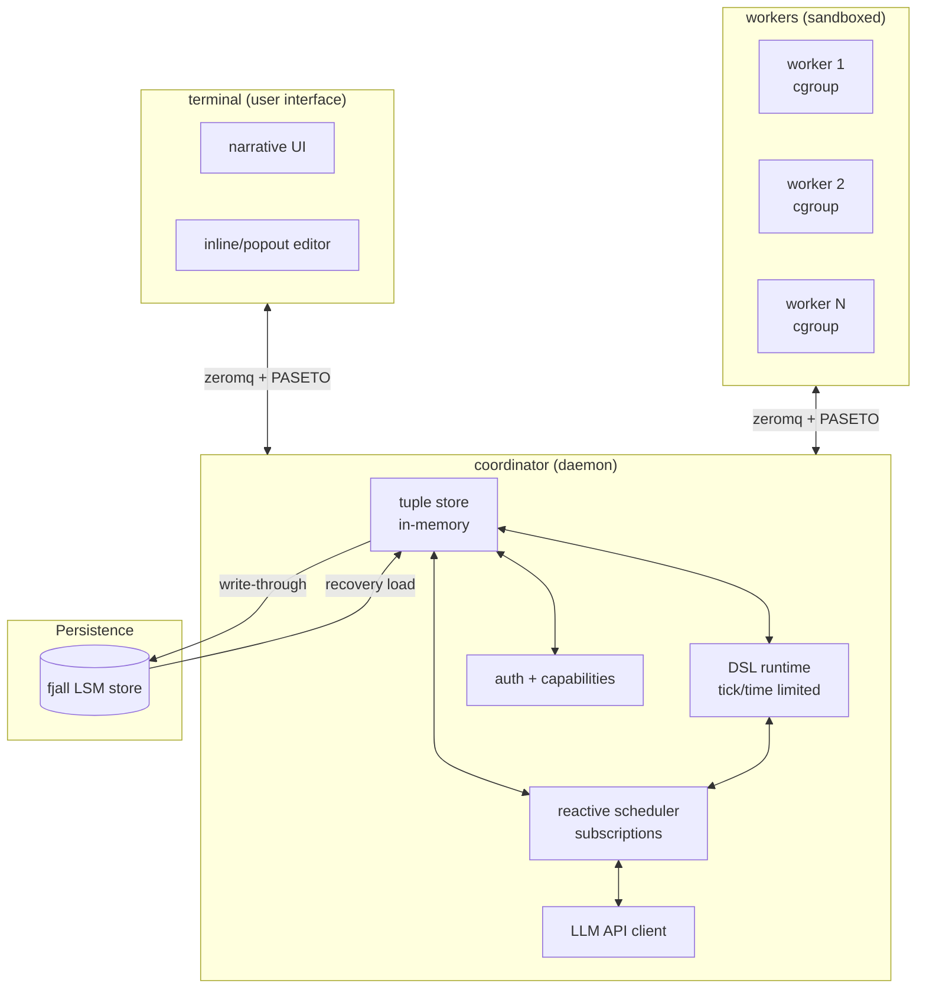
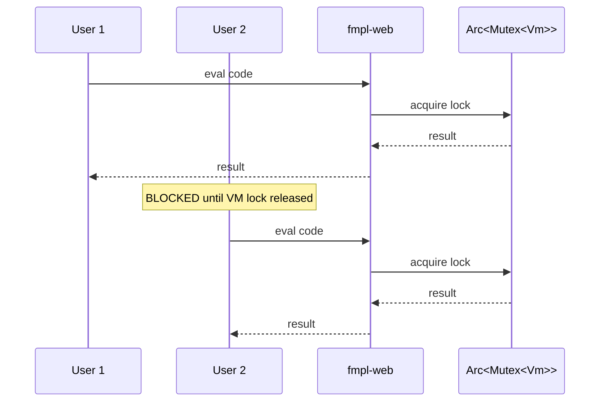
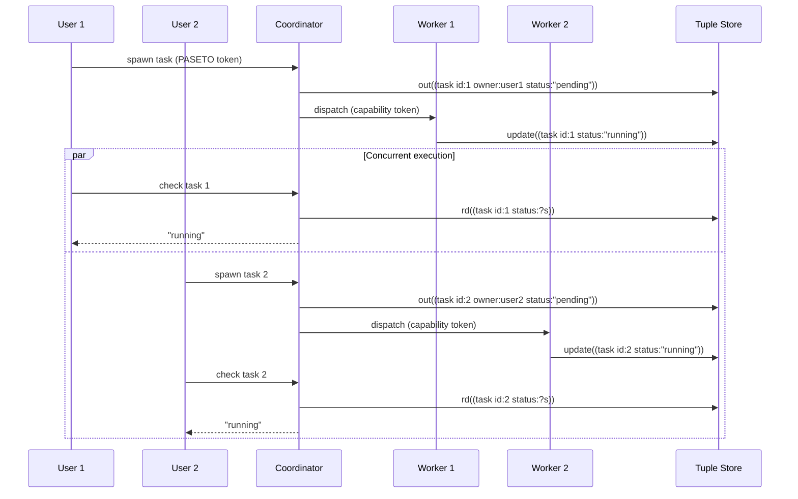
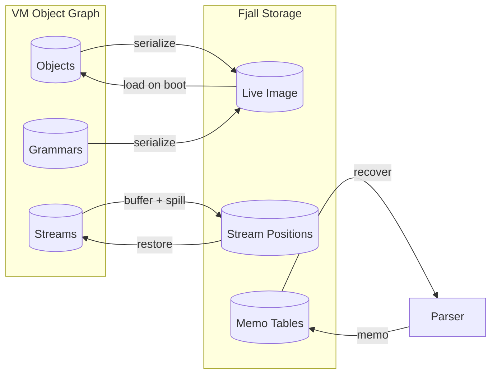
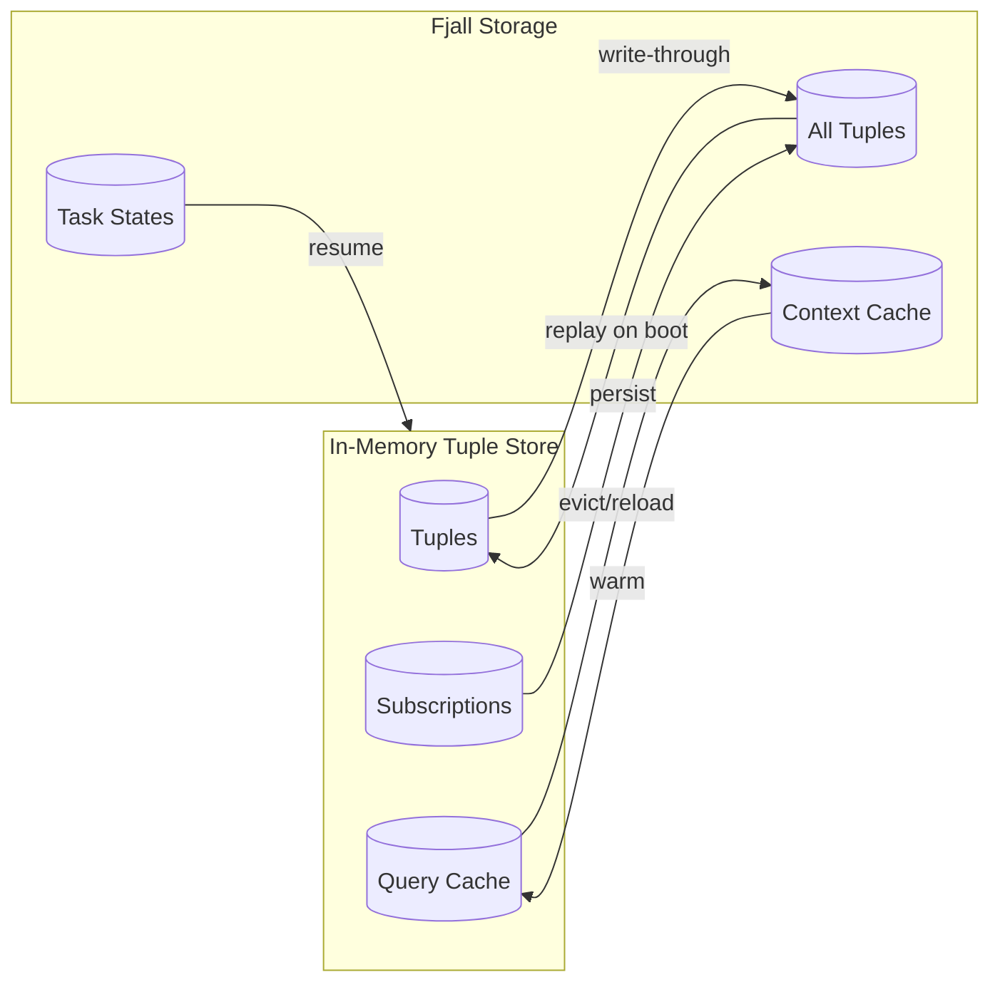
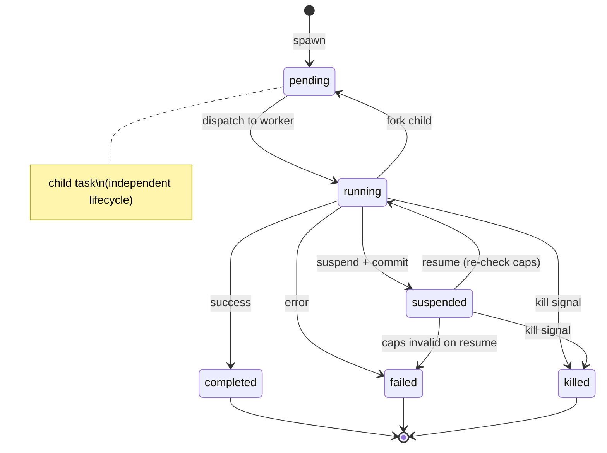
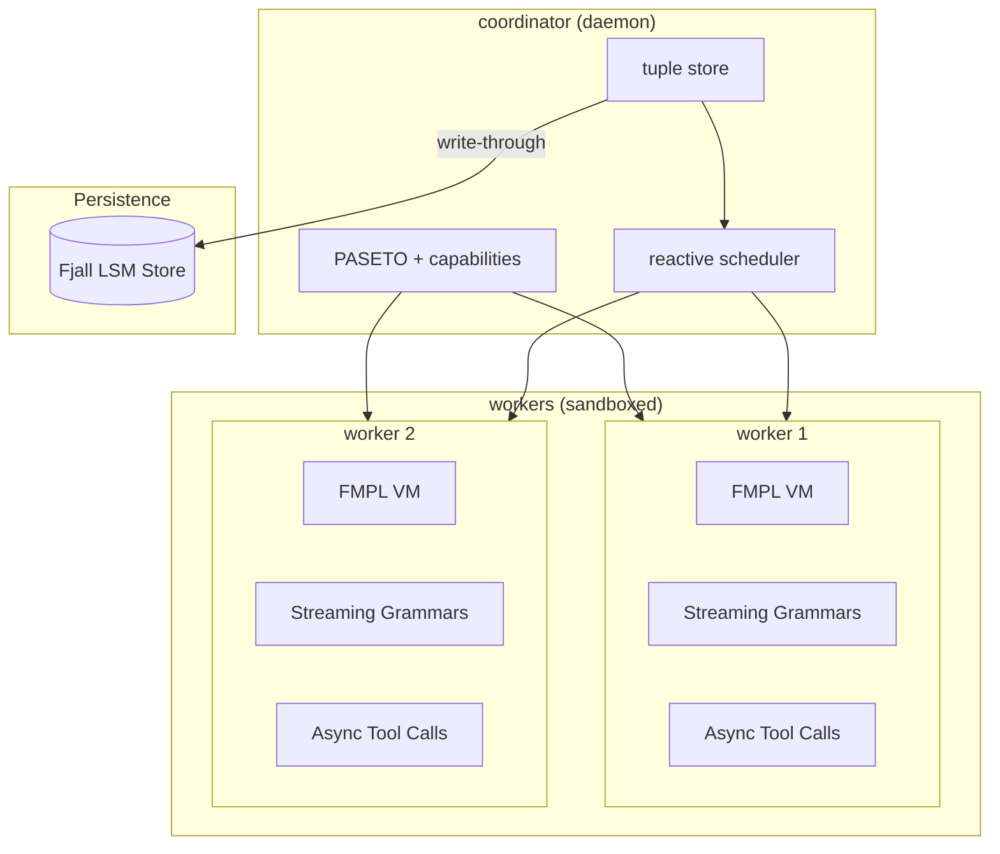

# FMPL vs. Collaborative Agentic System: Architecture Comparison

> **Date**: 2026-01-20
> **Status**: FMPL has implemented streaming grammars, async infrastructure; agentic system is a separate design

---

## Executive Summary

| Aspect | FMPL | Collaborative Agentic |
|--------|------|---------------------|
| **Architecture** | Single-process VM with async ops | Multi-process coordinator + workers |
| **Coordination Model** | Grammars over streams | Tuple space with reactive subscriptions |
| **Multi-user** | Not designed (shared VM) | First-class (users as entities, PASETO) |
| **Execution Model** | Stack-based VM with async streams | Reactive task scheduling |
| **Persistence** | Fjall (object graph, streaming) | Fjall (tuple store, write-through) |
| **Security** | Facets (access control) | Capabilities (hierarchical, revocable) |
| **LLM Integration** | Streaming grammars over async streams | Centralized API client with caching |
| **Sandboxing** | None | cgroups, seccomp, per-task limits |

**Key Insight**: FMPL approaches agents as **grammars over streams** (push model, pattern-based), while the collaborative system uses **tuple spaces with reactive subscriptions** (pull/push hybrid, state-based).

---

## FMPL Architecture

```mermaid
graph TB
    subgraph FMPL["fmpl-web (single process)"]
        Server[Axum HTTP Server]
        VM[Shared Arc<Mutex<Vm>>]
        Runtime[Tokio Runtime]
    end

    subgraph Grammar["Streaming Grammars"]
        Grammar[Grammar Definition]
        Parser[PEG Parser]
        Stream[Async Stream]
    end

    subgraph Persistence["Fjall Persistence"]
        Store[(LSM Store)]
        Image[(Live Image)]
    end

    subgraph External["External Tools"]
        LLM[LLM API]
        HTTP[HTTP/WS]
    end

    Server --> Runtime
    Runtime --> VM
    VM --> Grammar
    Grammar --> Parser
    Parser --> Stream
    Stream --> LLM
    Stream --> HTTP
    VM --> Store
    Store --> Image
```

### Current FMPL Components

**Implemented:**
- ✅ **Streaming grammars**: Incremental PEG parsing with backtracking
- ✅ **Async operations**: `<-` operator returns streams, tokio runtime handle
- ✅ **Fjall persistence**: Live image serialization, streaming position overflow
- ✅ **Grammar application**: `@` operator for pushing values through grammars
- ✅ **Exception handling**: Cross-frame exception unwinding with try/catch
- ✅ **Stream pipelines**: Lazy stream operations (map, filter, parse, async-parse)

**Partial/Designed:**
- ⏳ **LLM integration**: Streaming grammars designed for LLM output, but no client
- ⏳ **Tuple operations**: Linda-style `out`/`in`/`rd` not implemented
- ⏳ **Task model**: No task abstraction, suspend/resume not full
- ⏳ **Multi-user**: Single `Arc<Mutex<Vm>>` — no isolation

**Not designed:**
- ❌ **Multi-process**: Single VM only
- ❌ **Coordinator**: No separate process
- ❌ **Worker sandboxing**: No cgroups, no resource limits
- ❌ **Capabilities**: No PASETO, no hierarchical attenuation
- ❌ **Reactive scheduling**: No subscription system

---

## Collaborative Agentic System Architecture



### Agentic System Components

**Coordinator (daemon process):**
- **Tuple store**: In-memory persistent datalog with logical queries
- **Reactive scheduler**: Subscription-based dispatch on tuple changes
- **DSL runtime**: Tick-limited, time-limited execution
- **LLM client**: Centralized API access with caching
- **Auth + capabilities**: PASETO tokens, hierarchical attenuation
- **Persistence**: Write-through to Fjall, instant recovery

**Workers (sandboxed processes):**
- Each worker: tokio runtime, FMPL or DSL execution
- cgroup isolation: CPU, memory, I/O limits
- seccomp filters: System call restrictions
- Capability tokens: Per-task scope

---

## Philosophy: Agents as Grammars vs. Tasks as Tuples

### FMPL: Agents = Grammars Over Streams (Push Model)

```fmpl
-- Agent is a grammar that pattern-matches on a message stream
grammar TaskAgent <: Agent {
  turn =
    | message:m &{ needs_approval(m) } => <- human.ask(m) @ approval_handler
    | message:m &{ authorized(m) } => <- execute_tool(m) @ result_handler

  result_handler =
    | %{tool: t, args: a} => <- execute(t, a) @ result_handler
    | %{done: result} => yield(result)
}

-- Stream of messages through agent grammar
message_stream |> TaskAgent.turn @ result_stream
```

**Key ideas:**
- Agent control flow = grammar pattern matching
- Push model: Values flow through grammars via `@` operator
- Semantic predicates `&{ ... }` compute context mid-match
- Async tool calls via `<-` return streams
- Backtracking unlimited (buffered, spills to Fjall)
- Memoization prevents redundant work

**Advantages:**
- Declarative: Agent behavior expressed as patterns
- Composable: Grammars can inherit and extend
- Pure: No mutable state in agent definition
- Type-safe: Patterns type-check at compile time

**Disadvantages:**
- No shared state between agents (must tuple-ify manually)
- No reactive subscriptions (must poll streams)
- No hierarchical capabilities (facets only)
- No task lifecycle (grammar just transforms)

---

### Agentic System: Tasks = Entities in Tuple Space (Pull/Push Model)

```
-- Agent spawns child tasks, writes to tuple space
spawn {
  -- Create task tuple
  out((task id:123 type:"search" status:"pending"))

  -- Subscribe to completion
  on (task ?id status:"completed") {
    resume_with(result)
  }
}

-- Coordinator dispatches via reactive scheduler
-- (subscription fires when task tuple changes)
```

**Key ideas:**
- Agent = task with lifecycle (spawn → running ↔ suspended → completed/failed/killed)
- Pull/push model: Tasks pull from tuple space, scheduler pushes on changes
- Reactive scheduling: Subscriptions fire on tuple changes
- Hierarchical capabilities: User → Worker → Task → Subtask
- Durable suspension: Serialize task state to Fjall

**Advantages:**
- Shared coordination: Tuple space provides shared memory
- Reactive: No polling, subscriptions push on changes
- Isolation: Each task isolated, capabilities enforce bounds
- Hierarchical: Fork children, compose workflows

**Disadvantages:**
- Imperative: Agent logic in DSL, not declarative grammars
- Stateful: Tasks hold mutable state
- Error-prone: Manual tuple management, no type safety
- Complex: Requires coordinator, scheduler, subscriptions

---

## Comparison: Coordination Primitives

### Tuple Space vs. Streams

| Operation | Tuple Space (Agentic) | Streams (FMPL) |
|-----------|---------------------|----------------|
| **Write** | `out((foo bar))` | stream.push(value) |
| **Read (non-blocking)** | `rd((foo ?x))` | stream.peek() |
| **Take (blocking)** | `in((foo ?x))` | stream.recv() |
| **Subscribe** | `on ((foo ?x)) { handler }` | stream.subscribe() |
| **Pattern matching** | `(foo ?x bar ?y)` | grammar patterns over values |
| **Persistence** | Automatic (tuple store durable) | Explicit (serialize stream state) |

**Tradeoffs:**
- **Tuple space**: Shared memory model, reactive subscriptions, but untyped
- **Streams**: Immutable pipeline model, declarative patterns, but no shared state

**Convergence possible:**
```fmpl
-- FMPL could expose tuple space operations as stream sources
let (task_stream = tuple_space.subscribe("(task ?id status: ?s)")) in
  task_stream |> filter(|t| t.status == "pending") |> dispatch
```

---

## Comparison: Multi-User Architecture

### FMPL: Single VM (Not Multi-User)



**Issues:**
- No isolation: All users share same object graph
- Sequential: Requests block on VM lock
- No security: Any user can modify any object
- No capabilities: No access control beyond facets

---

### Agentic System: Coordinator + Workers (Multi-User)



**Advantages:**
- Isolation: Each worker has separate VM/runtime
- Parallel: Multiple tasks run concurrently
- Security: Capability tokens scope access
- Namespaces: `/user/`, `/project/` isolation

---

## Comparison: Persistence Models

### FMPL: Live Image Streaming to Fjall



**Features:**
- Live image: Entire VM state serialized (objects, grammars, bindings)
- Streaming: Async streams buffer positions, spill to Fjall on overflow
- Incremental parsing: ParseState/ParseNext serialize for durable suspension
- Memoization: Per-position memo tables with Fjall backing

**Use cases:**
- Restart: Reload entire VM state from Fjall
- Backtracking: Restore stream positions from Fjall
- Suspension: Serialize ParseState for resume later

---

### Agentic System: Tuple Store Write-Through to Fjall



**Features:**
- Tuple store: All coordination data as tuples
- Subscriptions: Pattern-based triggers on tuple changes
- Write-through: Every mutation persisted to Fjall
- Instant recovery: Replay tuples on coordinator restart

**Use cases:**
- Restart: Replay all tuples, re-register subscriptions
- Suspend: Serialize task state to tuple
- Resume: Deserialize task from tuple, re-validate capabilities

---

## Comparison: Async Execution

### FMPL: Stream-Based Async

```fmpl
-- Async call returns a stream
let (%{source: body} = <- curl.get(url)) in
  body @ json.value @ result_handler

-- Pipe stream to grammar for incremental parsing
llm_tokens |> ToolParser.tool_call @ execute_tool

-- Pattern destructuring on stream results
result_handler =
  | %{ok: v} => handle_success(v)
  | %{err: e} => handle_error(e)
```

**Execution flow:**
1. `<-` operator creates async task via tokio runtime
2. Returns stream handle backed by tokio channel
3. Stream emits values as they arrive (push model)
4. Grammar pattern-matches on stream values
5. Backtracking unlimited (buffered positions with Fjall overflow)

**Advantages:**
- Composable: Stream operations chain via `@` operator
- Incremental: Grammar parses as values arrive
- Backtracking: Full PEG semantics with memoization
- Type-safe: Patterns check at compile time

---

### Agentic System: Task-Based Async

```
-- Task spawns and suspends, waiting for event
spawn {
  let (task_id = spawn_subtask())
  suspend until (task ?id status:"completed")
  let (result = rd((task ?id ?result)))
  return result
}

-- Scheduler resumes when subscription fires
on (task ?id status:"completed") {
  notify_parent(task_id, result)
}
```

**Execution flow:**
1. Task spawns child, writes to tuple space
2. Suspends (commits state, releases worker)
3. Scheduler detects completion via subscription
4. Resumes task with result tuple
5. Task re-validates capabilities before continuing

**Advantages:**
- Reactive: No polling, subscriptions push on changes
- Hierarchical: Fork children, compose workflows
- Durable: Suspend state serialized to Fjall
- Capable: Hierarchical capabilities enforce isolation

---

## Comparison: Security Models

### FMPL: Facets (Access Control)

```fmpl
-- Object with facets for access control
let (doc = object Document {
  content: "secret",
  facets: [
    facet(:public) { read: true, write: false },
    facet(:editor) { read: true, write: true }
  ]
}) in

-- Access via facet
doc.as(:public).read()  -- OK
doc.as(:public).write("new")  -- ERROR
```

**Features:**
- Facets: Named access control surfaces on objects
- Explicit: Must request facet before accessing
- No attenuation: Facets don't compose or narrow
- No revocation: Facets are static on objects

**Limitations:**
- No hierarchical capabilities
- No runtime revocation
- No principle of least privilege
- No per-task isolation

---

### Agentic System: Hierarchical Capabilities

```
User caps: fs:**, shell:*, net:*
  ↓ grants subset
Worker caps: fs:read:/src/project/**, fs:write:/src/project/src/**, shell:cargo
  ↓ LLM attenuates
Task caps: fs:read,write:src/foo.rs, shell:cargo test
  ↓ attenuates
Subtask caps: fs:read:src/foo.rs, shell:cargo test --no-run

-- Escalation flow
task requests cap fs:write:config.toml
  → coordinator checks: within worker ceiling?
  → YES: prompt user "Grant for task/session/deny?"
  → user chooses "session"
  → coordinator adds cap to worker (future tasks can use)
```

**Features:**
- Hierarchical: User → Worker → Task → Subtask
- Attenuation: Caps can only narrow, never widen
- Revocation: Delete signing key → all tokens instantly invalid
- Escalation: Modal prompts, suspend + request
- Namespace-based: `/project/foo/task:123` scoping

**Advantages:**
- Principle of least privilege: Minimum caps per task
- Auditability: All cap changes logged to tuple space
- Revocable: Instant token invalidation
- Hierarchical: Compose complex workflows

---

## Comparison: Task Lifecycle

### FMPL: No Task Abstraction

FMPL has no first-class task concept:
- No spawn/fork/suspend/resume
- No task state serialization
- No task hierarchy
- No reactive scheduling

**Workaround**: Use async streams and continuations
```fmpl
-- Simulate task via stream and callback
let (%{source: result} = <- execute_async(...)) in
  result @ success_handler
```

**Limitations**:
- No task identity (can't reference "task 123")
- No hierarchy (can't fork children)
- No durable suspend (no task state to serialize)
- No reactive dispatch (must poll streams)

---

### Agentic System: Full Task Lifecycle



**Features:**
- First-class tasks: Identity, state, lifecycle
- Fork: Parent commits, child sees committed state
- Suspend: Serialize state to Fjall, release worker
- Resume: Deserialize state, re-validate capabilities
- Kill: Non-hierarchical, children become orphans

**Tuples:**
```
(task <id> status <running|suspended|completed|killed|failed>)
(task <id> parent <parent-id | nil>)
(task <id> assigned-to <worker-id | nil>)
(task <id> waiting-for <event-type> <event-key>)
(task <id> result <value | error>)
(task <id> namespace <ns>)
```

---

## Comparison: LLM Integration

### FMPL: Streaming Grammars (Designed, Not Built)

```fmpl
-- Grammar that parses LLM output incrementally
grammar ToolParser <: base::tree {
  tool_call = %{tool: :string, args: :any}
  error = %{error: :string}
}

-- LLM stream through grammar, emit matches
llm_output_stream |> ToolParser.tool_call @ execute_tool

-- Semantic predicates compute context mid-match
grammar ContextAwareParser <: base::tree {
  tool_call =
    | %{tool: :string} &{ tool_requires_approval(tool) }
      => <- human.ask(approve(tool)) @ approval_handler
    | %{tool: :string, args: :a} &{ authorized(tool, a) }
      => execute(tool, a)
}
```

**Features (designed):**
- Incremental parsing: Parse as tokens arrive
- Backtracking: Full PEG semantics, unlimited
- Semantic predicates: `&{ expr }` computes context mid-match
- Async tool calls: `<- human.ask()` for human-in-loop

**Status**:
- ✅ Grammar system implemented
- ✅ Async infrastructure implemented
- ⏳ LLM client not built
- ⏳ Human interaction not built

---

### Agentic System: Centralized LLM Client (Designed)

```
-- Task requests LLM completion via tuple space
let (result = spawn {
  out((llm_request id:123 prompt:"..." model:"gpt-4"))
  suspend until (llm_response id:123 ?response)
  return response
})

-- Coordinator handles request
on (llm_request ?id) {
  let (cached = lookup_cache(id))
  if (cached != nil) {
    out((llm_response id:?id response:cached))
  } else {
    let (result = openai_api.call(request.prompt))
    store_cache(id, result)
    out((llm_response id:?id response:result))
  }
}
```

**Features (designed):**
- Centralized: All LLM calls through coordinator
- Cached: Context-cache tuples prevent redundant calls
- Cost-tracked: Token usage logged per task/session
- Escalatable: Cost limits trigger prompts

**Status**:
- ⏳ Coordinator not built
- ⏳ LLM client not built
- ⏳ Tuple store not built

---

## Comparison: Scalability Model

### FMPL: Single Process

```
fmpl-web (single binary)
  └── Arc<Mutex<Vm>>
      └── tokio runtime
          └── N concurrent async tasks
```

**Scalability:**
- Limited by VM lock contention
- No horizontal scaling (single process)
- No process isolation (one crash = all fail)
- No resource limits (memory/CPU unbounded)

**Use case**: Single-user REPL, storylet games

---

### Agentic System: Coordinator + N Workers

```
coordinator (daemon)
  └── tuple store (in-memory)
      └── scheduler
          └── N workers (separate processes)
              ├── worker 1 (cgroup, seccomp)
              ├── worker 2 (cgroup, seccomp)
              └── worker N (cgroup, seccomp)
```

**Scalability:**
- Coordinator: O(1) dispatch via subscriptions
- Workers: Horizontal scaling (add more processes)
- Isolated: Worker crash doesn't affect others
- Bounded: Cgroups limit CPU/memory per worker

**Use case**: Multi-user agentic workflows

---

## Convergence Path: Hybrid Architecture

**Key insight**: FMPL's streaming grammars are a powerful agent primitive. The agentic system's tuple space provides coordination. Combine them:



**Hybrid design:**
1. **Coordinator**: Tuple store, reactive scheduler, capabilities (from agentic)
2. **Workers**: Run FMPL VM with streaming grammars (from FMPL)
3. **Agents**: FMPL grammars over streams (push model)
4. **Coordination**: Tuple space for shared state, subscriptions (pull/push)
5. **Persistence**: Fjall for both tuple store and streaming state

**Benefits:**
- Declarative agents: FMPL grammars express agent behavior cleanly
- Shared coordination: Tuple space provides reactive coordination
- Isolation: Each worker has separate FMPL VM
- Capabilities: Hierarchical PASETO tokens enforce least privilege
- Scalability: Coordinator dispatches, workers execute in parallel

**Implementation roadmap:**
1. Build coordinator with tuple store and scheduler (from agentic)
2. Build worker runtime that spawns FMPL VM instances (from FMPL)
3. Add tuple operations to FMPL DSL (`out`/`in`/`rd`)
4. Add PASETO token support to workers
5. Wire grammars to tuple space (grammar reads from tuples, writes to tuples)

---

## Summary: Divergence and Convergence

### Where FMPL Diverges

| Aspect | FMPL Approach | Agentic Approach | Why? |
|--------|----------------|------------------|------|
| **Agent model** | Grammars over streams (declarative) | Tasks in tuple space (imperative) | FMPL prioritizes expressiveness, agentic prioritizes coordination |
| **Coordination** | Stream pipelines (push only) | Tuple space (pull + push) | FMPL has no shared memory, agentic has tuple space |
| **Multi-user** | Not designed (single VM) | First-class (PASETO, namespaces) | FMPL is single-user REPL, agentic is multi-user system |
| **Security** | Facets (static) | Capabilities (hierarchical, revocable) | FMPL is unprivileged, agentic needs strong security |
| **Execution** | VM with async streams | Reactive task scheduling | FMPL is interpreter, agentic is distributed system |

### Where FMPL Converges

| Aspect | FMPL | Agentic | Convergence |
|--------|------|----------|-------------|
| **Persistence** | Fjall (live image) | Fjall (tuple store) | Same storage tech, different data model |
| **Incremental parsing** | ParseState/ParseNext | Task suspend/resume | Same serialization pattern |
| **Async execution** | Tokio channels | Tokio channels (in workers) | Same async runtime |
| **Backtracking** | Unlimited (PEG + Fjall) | Not applicable | FMPL stronger |
| **Declarative patterns** | Grammar patterns | Tuple patterns | Similar expressiveness |

### Strategic Recommendation

**Option 1: FMPL as-is (single-user)**
- ✅ Best for: Storylet games, interactive REPL, research
- ❌ Not suitable for: Multi-user agentic workflows
- Effort: Minimal (continue current direction)

**Option 2: Build separate agentic system**
- ✅ Best for: Multi-user AI-assisted development
- ✅ Clean architecture (no legacy)
- ❌ Duplicate effort (FMPL already has streaming grammars)
- Effort: 6-12 months (coordinator, tuple store, scheduler, workers)

**Option 3: Hybrid (recommended)**
- ✅ Best of both: FMPL grammars + tuple coordination
- ✅ Leverage FMPL investment (6,500 lines of streaming grammar work)
- ✅ Incremental path: Start with FMPL, add coordinator layer
- ❌ Architectural complexity (two coordination models)
- Effort: 4-8 months (coordinator + worker wrapper)

---

## Implementation Priority

### If pursuing Option 3 (Hybrid):

**Phase 1: FMPL Continuations (in progress)**
- [ ] Complete Tasks 6-9 in streaming grammar plan
- [ ] Add `out`/`in`/`rd` tuple operations to FMPL DSL
- [ ] Add `spawn`/`suspend`/`resume` task operations
- [ ] Add PASETO token verification to VM

**Phase 2: Worker Runtime**
- [ ] Build worker process that spawns FMPL VM instances
- [ ] Add cgroup/seccomp sandboxing
- [ ] Add ZeroMQ + PASETO client
- [ ] Add heartbeat and liveness monitoring

**Phase 3: Coordinator**
- [ ] Build coordinator daemon with tuple store
- [ ] Implement reactive scheduler with subscriptions
- [ ] Add PASETO token signing/verification
- [ ] Add OpenAI API client with caching

**Phase 4: Integration**
- [ ] Wire workers to coordinator via ZeroMQ
- [ ] Implement task dispatch and recovery
- [ ] Add namespace-based capability enforcement
- [ ] Build terminal UI

**Estimated total**: 4-8 months depending on team size and prioritization.

---

## References

### FMPL Design Docs
- [FMPL Revival Design](2025-12-19-fmpl-revival-design.md) - Overall language vision
- [Unified Grammars and Agents](2026-01-19-unified-grammars-and-agents-design.md) - Agent as Grammar pattern
- [Streaming Grammar Push Model](2026-01-20-streaming-grammar-push-model-implementation-plan.md) - Incremental parsing implementation

### FMPL Implementation
- `fmpl-core/src/grammar/` - OMeta-style PEG grammars
- `fmpl-core/src/grammar/incremental.rs` - ParseState/ParseNext
- `fmpl-core/src/grammar/driver.rs` - ParseDriver for async pipelines
- `fmpl-core/src/stream.rs` - Async stream handles
- `fmpl-web/src/main.rs` - Axum server with Arc<Mutex<Vm>>

### Agentic System Design
- (This document) - Multi-user, multi-agent system design
- [LindaSpaces Book](research/lindaspaces-book/) - Tuple space coordination patterns
- [Tuplespace VAT Actor Conversion](research/2025-12-27-tuplespace-vat-actor-conversion.md) - Research on Linda-style coordination

### Related Work
- [OMeta](https://tinlizzie.org/ometa/) - OMeta PEG parsing
- [Spritely Goblins](https://spritely.institute/goblins/) - Async object capability patterns
- [mooR](https://timbran.org/book/html/introduction.html) - MOO-style object database
- [RLM (Recursive Language Models)](https://alexzhang13.github.io/blog/2025/rlm/) - Agent coordination without context rot

---

**Status**: FMPL has a strong foundation in streaming grammars and async infrastructure. The agentic system design provides a path to multi-user, multi-agent workflows. The hybrid approach (Option 3) is recommended to leverage FMPL's declarative agent model while adding the coordination, security, and multi-user capabilities of the agentic system.
